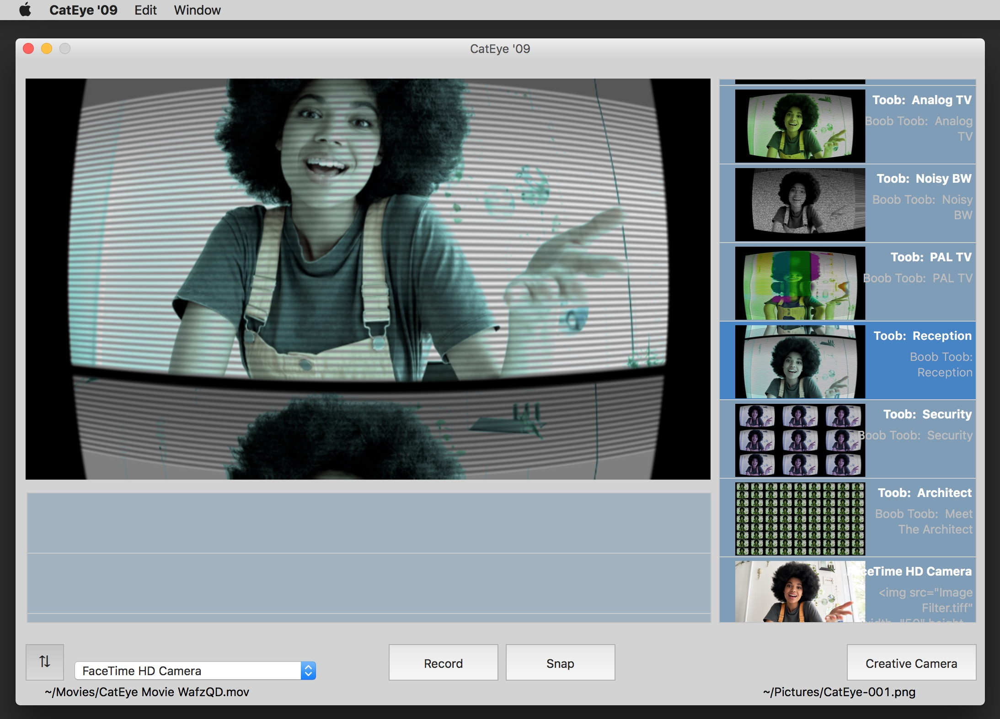
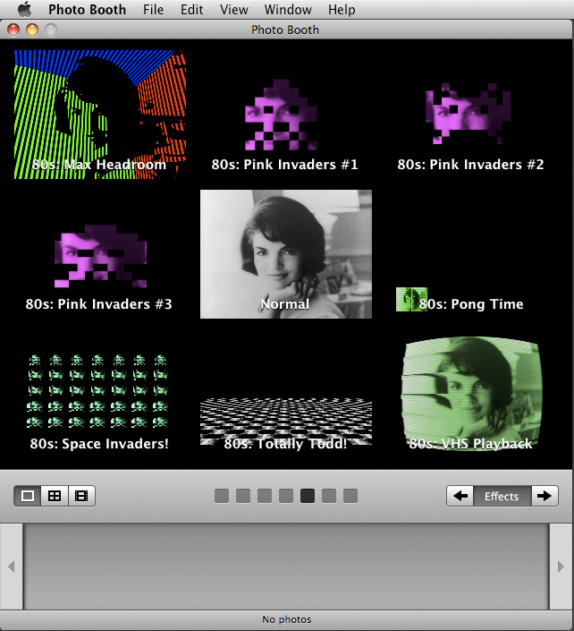
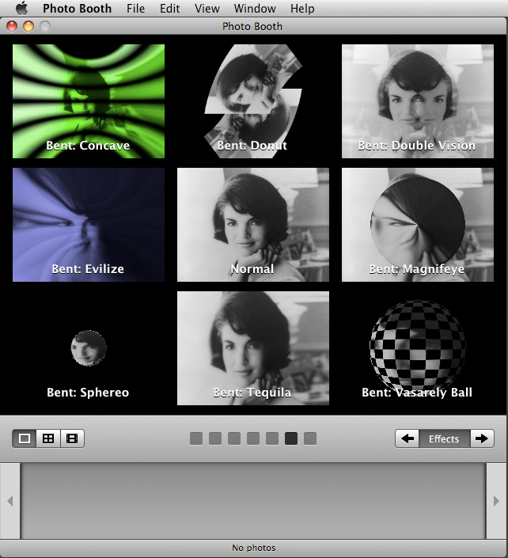
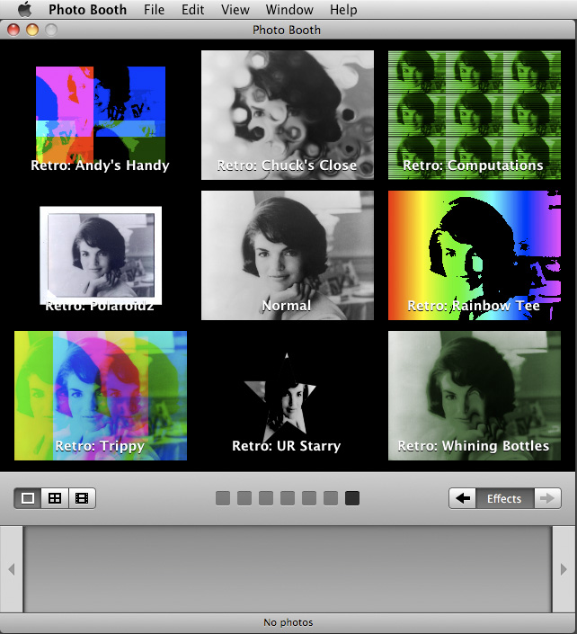

# CatEye
Real-time webcam (GPU/GLSL) F/X for Apple PhotoBooth 2007-Present. GLSL, CIFilter kernel language, Objective-C++/C++.

## CatEye '09

Modern Photo Booth 'clone' featuring user-installable Quartz Composer F/X, movie recording, still image capture, adjustable F/X parameters and more!  

Runs on all Macs manufactured since 2006 (Intel and Apple Silicon).  Includes 'Creative Camera' webcam driver(s) for Macintel and Apple Silicon for exporting live F/X camera feed to other camera apps (Zoom etc).

[b-l-a-c-k-o-p.com/cateye.html](https://b-l-a-c-k-o-p.com/cateye.html)

### "Making PhotoBooth great again."

## CatEye '07
Quartz Composer (GPU F/X) Plug-ins for Apple Photo Booth (and others), initially released in 2007-ish for PowerPC and Intel.  Updated for Apple Silicon 2020-ish.

