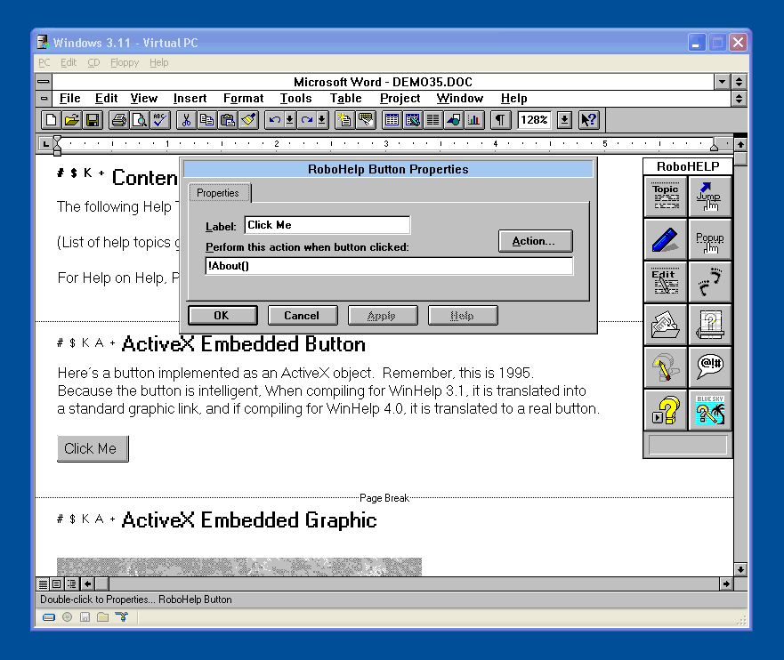
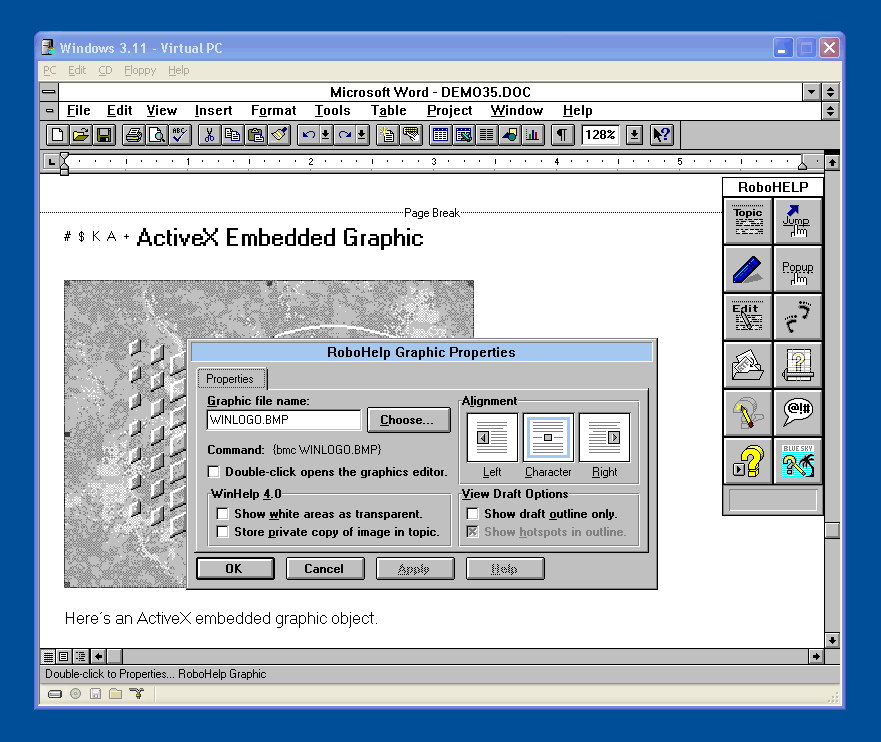
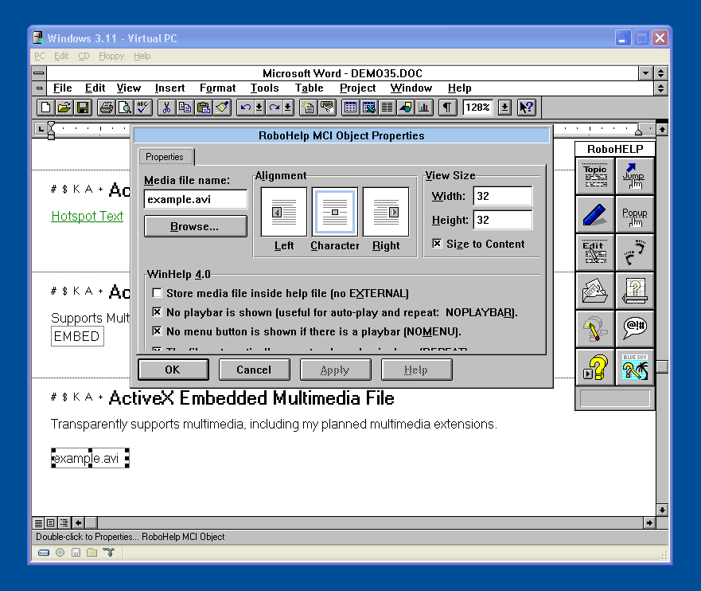

# Adobe RoboHelp
Product originator, principal developer, UI/UX and program management, versions 1.0 - 3.5.

## Interview

[Adobe Interview](https://www.youtube.com/watch?v=xhBErI7Hdso)

LINK: https://www.youtube.com/watch?v=xhBErI7Hdso

## RoboHelp 3.5 - ActiveX (COM+)
After saving, the RTF document was post-processed (C++ parser) and the COM+ data deserialized and transformed into appropriate WinHelp RTF syntax.

